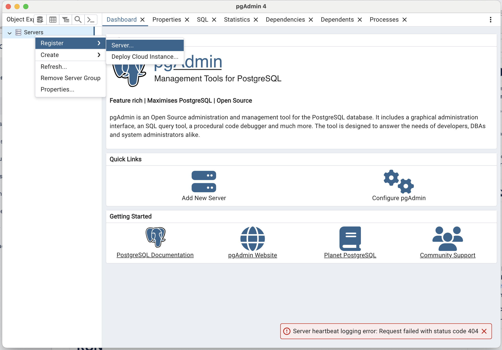
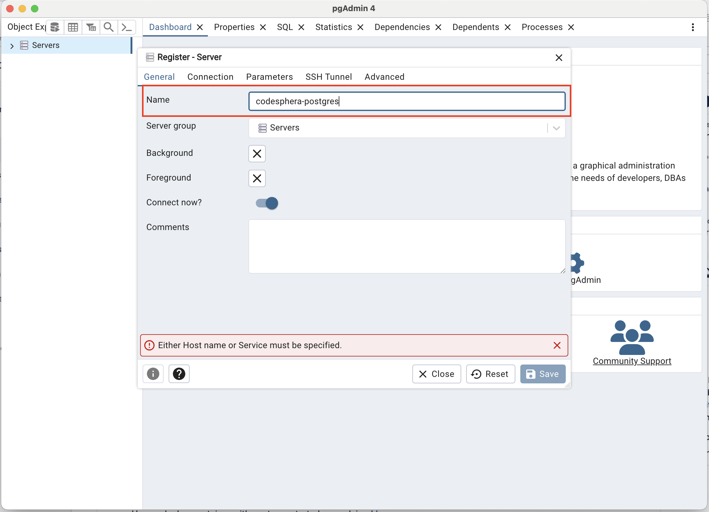
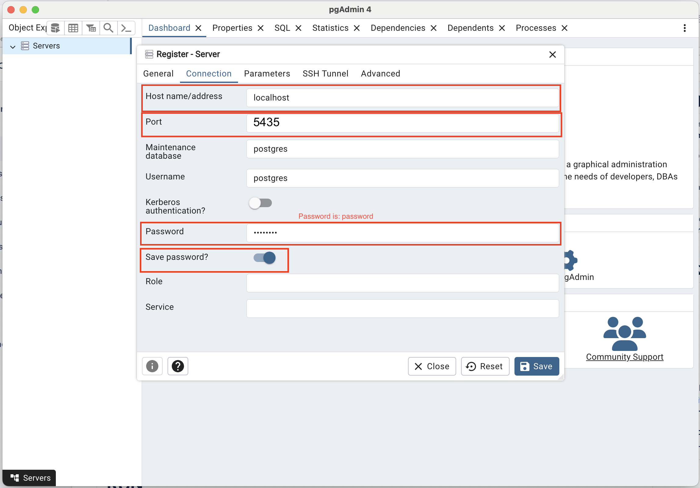

# Boilerplate go

## Install docker

Installation [instructions](https://docs.docker.com/desktop/setup/install)

For Mac:
- make sure to open the app before 

For Linux:
- add the user to the docker group `sudo usermod -aG docker <username>`
- check the docker service `sudo systemctl status docker`, and if it's not active execute `sudo systemctl enable --now docker`

---

Check the docker installation with `docker run hello-world`

Start the database docker container with `docker compose up -d` in the project's directory

Check the container with `docker ps`

## Install pgadmin4

[Ubuntu](https://www.pgadmin.org/download/pgadmin-4-apt/)

[Mac](https://formulae.brew.sh/cask/pgadmin4)

### Connect to the database with PgAdmin

Register a new server



Give it a name



Give it it's properties (the password is `password`) :))



## Intall go

### Using goenv

Execute the following code:
```
shell=$(basename "$(echo $SHELL)") 
case $shell in
  zsh) rcfile="$HOME/.zshrc" ;;
  bash) rcfile="$HOME/.bashrc" ;;
  *) >&2 echo "unsupported shell" && exit 1
esac

git clone https://github.com/go-nv/goenv.git ~/.goenv

echo 'export GOENV_ROOT="$HOME/.goenv"' >> "$rcfile"
echo 'export PATH="$GOENV_ROOT/bin:$PATH"' >> "$rcfile"
echo 'eval "$(goenv init -)"' >> "$rcfile"
echo 'export PATH="$GOROOT/bin:$PATH"' >> "$rcfile"
echo 'export PATH="$PATH:$GOPATH/bin"' >> "$rcfile"

exec $SHELL
```

then go to the project's directory and execute:
```
goenv install
go run .
```

### Directly

For Mac: `brew install go`

For Linux and Windows: [instructions](https://go.dev/doc/install#install)

then go to the project's directory and execute:
```
go run .
```

## Install direnv 

[For Windows]( https://gist.github.com/rmtuckerphx/4ace28c1605300462340ffa7b7001c6d )

[For Mac]( https://formulae.brew.sh/formula/direnv )

For Ubuntu:
```
wget http://cz.archive.ubuntu.com/ubuntu/pool/universe/d/direnv/direnv_2.32.1-2build1_amd64.deb
dpkg -i direnv_2.32.1-2build1_amd64.deb
```

then install the direnv hook (only mac and linux):
```
shell=$(basename "$(echo $SHELL)") 
case $shell in
  zsh) rcfile="$HOME/.zshrc" ;;
  bash) rcfile="$HOME/.bashrc" ;;
  *) >&2 echo "unsupported shell" && exit 1
esac

echo "eval \"\$(direnv hook $shell)\"" >> "$rcfile"

exec $SHELL
```

then go to the project's directory and execute:
```
direnv allow
```
you should see something like this
```
direnv: loading ~/prog/tmp/curs1_boilerplate/.envrc                    
direnv: export +DB_CONNECTION_STRING +GOOSE_DBSTRING +GOOSE_DRIVER +GOOSE_MIGRATION_DIR
```

## Install [goose](https://github.com/pressly/goose) (read this a bit)

go to the project's directory and run
```
go install github.com/pressly/goose/v3/cmd/goose@latest
```

- test goose with `goose status`
- apply migrations with `goose up`
- rollback migrations with `goose down`
- create a new migration with `goose create <migration-name> sql` (we usually use sql migrations)
  this will create a file in `db/migration/<timestamp>_<migration_name>.sql` which you will edit
  

## Install [sqlc](https://docs.sqlc.dev/en/latest) (read this a bit too)

go to the project's directory and run
```
go install github.com/sqlc-dev/sqlc/cmd/sqlc@latest
```

then run `sqlc generate`, it should not give any errors

this will create the files
```
db/db.go               # the DBTX interface and Queries struct
db/models.go           # db models based on your schema
db/<query-file>.sql.go # multiple files like this which contain 
                       # methods on the Queries struct
                       # generated from the queries you gave
```

- you have to do `sqlc generate` and restart the server every time
  you change you schema (add a migration and do `goose up`) and when you
  add queries

## Install [templ](https://templ.guide/)

go to the project's directory and run
```
go install github.com/a-h/templ/cmd/templ@latest
```

## (Optional) Install wgo and run the project automatically

go to the project's directory and run
```
go install github.com/bokwoon95/wgo@latest
```
then you can run the project with `./run`

## Run the project

Run migrations `goose up`

Generate the sql queries `sqlc generate`

Generate the templ templates `templ generate`

Start the server `go run .`
